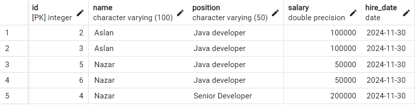
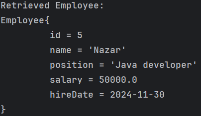
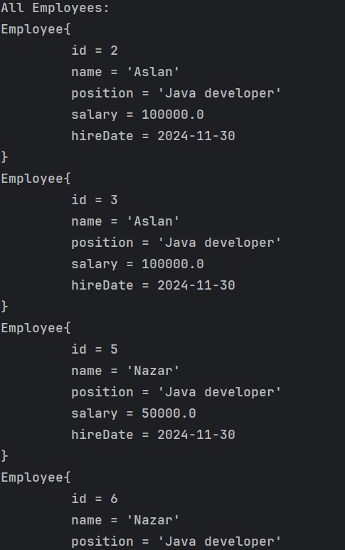
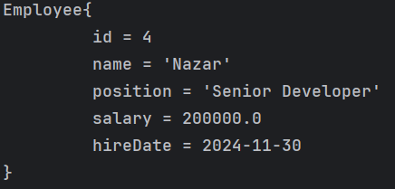

# Employee Database Management

## Description
A Java application that manages employee data using JDBC. Supports CRUD operations for an employee database.

## Features
- Add a new employee.
- Retrieve an employee by ID.
- Retrieve all employees.
- Update an employee's details.
- Delete an employee.

## How to Run
1. Set up Postgres and create the `employee_db` database.
2. Configure database credentials in `EmployeeData.java`.
3. Run the `Main` class to test the application.

## Screenshots
- My database in pgAdmin
- 
- Retrieving employee by id
- 
- Retrieving all employees
- 
- Updated employee
- 

